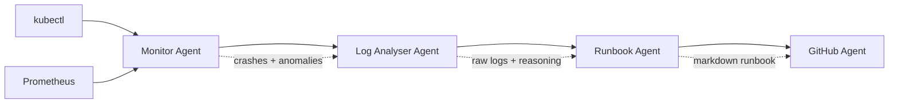

# AI DevOps Copilot

[](https://www.python.org/)
[](https://fastapi.tiangolo.com/)
[](https://langchain-ai.github.io/langgraph/)
[](https://groq.com/)
[](https://kubernetes.io/)
[](https://www.docker.com/)

Autonomous Kubernetes incident triage that monitors clusters, analyzes failures with an LLM, and generates GitHub issues with actionable runbooks.

## Overview

AI DevOps Copilot is a multi-agent incident response assistant for Kubernetes environments. It watches the cluster for crashing pods and metric anomalies, uses an LLM to reason about the most likely root cause, and turns that analysis into a structured runbook and GitHub issue.

The goal is to save SRE and DevOps teams time during the most expensive part of an outage: the first few minutes of triage. Instead of manually jumping between `kubectl`, Prometheus, logs, and ticketing, the system assembles a concise incident narrative and recommended next steps automatically.

## Architecture Diagram



## Key Features

- Multi-agent orchestration with LangGraph.
- ReAct-style tool calling with `kubectl` and Prometheus as operational tools.
- LLM-powered root cause analysis using Groq and Llama 3.3 70B.
- Auto-generated runbooks in Markdown for fast human follow-up.
- Automatic GitHub issue creation for durable incident tracking.
- Runs in-cluster with RBAC-scoped read-only permissions.
- Handles edge cases like Pending pods by falling back to `kubectl describe` instead of logs.

## Tech Stack

| Component | Technology | Purpose |
| --- | --- | --- |
| API layer | FastAPI | Exposes health, cluster, and analysis endpoints |
| Workflow engine | LangGraph | Orchestrates the multi-agent incident pipeline |
| LLM provider | Groq | Powers root-cause reasoning and runbook generation |
| Model | Llama 3.3 70B Versatile | Primary reasoning model |
| Cluster tooling | kubectl | Reads pod state, logs, and descriptions |
| Metrics tooling | Prometheus HTTP API | Detects CPU, memory, and restart anomalies |
| Issue tracking | GitHub API via PyGithub | Creates incident issues automatically |
| Runtime | Docker + Kubernetes | Containerized local and in-cluster deployment |

## How It Works

1. A caller sends `POST /analyze` with a namespace, or lets the API default to `default`.
2. The Monitor Agent reads the cluster through `kubectl` and Prometheus, collecting crashing pods plus CPU, memory, and restart anomalies.
3. If no issues are found, the pipeline stops early and returns a clean status.
4. If incidents are detected, the Log Analyser Agent fetches pod logs for up to the first three affected pods.
5. For Pending pods, it falls back to `kubectl describe` so scheduling and volume problems are still visible even when logs do not exist yet.
6. The Log Analyser Agent sends the combined evidence to Groq, then refines the answer with Prometheus context to produce the most likely root cause.
7. The Runbook Agent turns that diagnosis into a Markdown runbook with remediation, verification, and prevention steps.
8. The GitHub Agent creates an issue with the analysis and runbook so the incident is tracked outside the live session.

Example diagnosis output for a Pending workload with a missing PVC:

```json
{
	"status": "complete",
	"namespace": "default",
	"root_cause": "The pod is stuck in Pending because its spec references a PersistentVolumeClaim named data-volume that does not exist or is not bound in the namespace. The scheduler cannot place the pod until the claim is created and bound.",
	"runbook": "## Incident Summary\nPod is Pending due to a missing or unbound PVC.\n\n## Root Cause\nThe workload references `data-volume`, but no matching PVC is available.\n\n## Immediate Actions (numbered steps)\n1. Run `kubectl describe pod <pod> -n default` and confirm the PVC event.\n2. Check `kubectl get pvc -n default` for a missing or Pending claim.\n3. Create or correct the PVC manifest and re-apply it.\n\n## Verification Steps\n- Confirm the PVC moves to Bound.\n- Confirm the pod schedules and transitions to Running.\n\n## Prevention\n- Add pre-deploy validation for required PVCs."
}
```

## Project Structure

```text
.
├── main.py
├── agents/
│   ├── github_agent.py
│   ├── log_analyser_agent.py
│   ├── monitor_agent.py
│   └── runbook_agent.py
├── graph/
│   ├── agent_graph.py
│   └── state.py
├── k8s/
│   ├── deployment.yaml
│   ├── rbac.yaml
│   ├── secret-example.yaml
│   └── service.yaml
├── tools/
│   ├── kubectl_tools.py
│   ├── prometheus_tools.py
│   └── k8s_auth.py
├── utils/
│   └── groq_client.py
└── tests/
    ├── test_kubectl_tools.py
    ├── test_pipeline.py
    └── test_prometheus_tools.py
```

## Setup & Installation

1. Clone the repository.

```bash
git clone <your-repo-url>
cd AIDevOpsCopilot
```

2. Create and activate a virtual environment.

```bash
python3 -m venv .venv
source .venv/bin/activate
```

3. Install dependencies.

```bash
pip install -r requirements.txt
```

4. Create a `.env` file with your secrets and configuration.

```env
APP_ENV=local
GROQ_API_KEY=your_groq_api_key
GITHUB_TOKEN=your_github_token
GITHUB_REPO=your-org/your-repo
PROMETHEUS_URL=http://localhost:9090
```

5. Start a local Kubernetes cluster with Minikube.

```bash
minikube start
```

6. Run the API locally.

```bash
uvicorn main:app --reload --host 0.0.0.0 --port 8000
```

## Deployment

Build the container image and apply the Kubernetes manifests:

```bash
docker build -t devops-copilot:latest .
kubectl apply -f k8s/rbac.yaml
kubectl apply -f k8s/deployment.yaml
kubectl apply -f k8s/service.yaml
```

The deployment is designed to run with read-only RBAC permissions through `k8s/rbac.yaml`, which grants access to pods, logs, nodes, events, namespaces, PVCs, and ConfigMaps without allowing writes. Before deploying into a cluster, create the `devops-copilot-secrets` secret referenced by the deployment and update the image reference to a registry path if you are not using a local cluster image.

## API Endpoints

| Method | Endpoint | Description |
| --- | --- | --- |
| GET | `/health` | Returns service status and runtime configuration |
| POST | `/analyze` | Runs the end-to-end incident analysis pipeline for a namespace |
| GET | `/cluster/pods` | Returns crashing pods detected by `kubectl` |
| GET | `/cluster/metrics` | Returns Prometheus anomaly data for CPU, memory, and restarts |

Example request body for `/analyze`:

```json
{
  "namespace": "default"
}
```

## Example Output

```bash
curl -X POST http://localhost:8000/analyze \
  -H "Content-Type: application/json" \
  -d '{"namespace":"default"}'
```

Trimmed response:

```json
{
  "status": "complete",
  "namespace": "default",
  "root_cause": "The pod is Pending because it references a PersistentVolumeClaim that is missing or unbound, so the scheduler cannot place the workload.",
  "runbook": "## Incident Summary\nThe workload is blocked by a missing PVC.\n\n## Immediate Actions\n1. Inspect the pod events with `kubectl describe pod ...`.\n2. Verify the PVC exists with `kubectl get pvc -n default`.\n3. Create or fix the claim and re-deploy."
}
```

## Future Improvements

- Slack and Discord notifications for incident delivery.
- Auto-remediation for safe, low-risk fix types.
- Multi-cluster support with cluster-aware routing.
- Historical incident database for trend analysis and reuse.

## License

MIT
